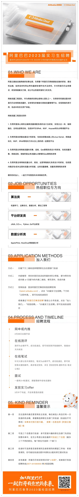
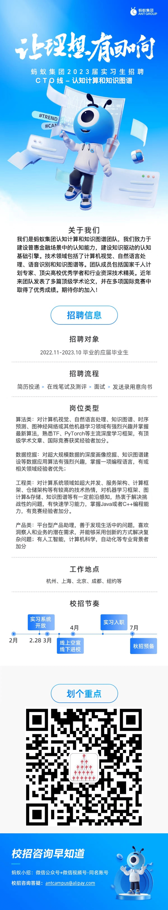
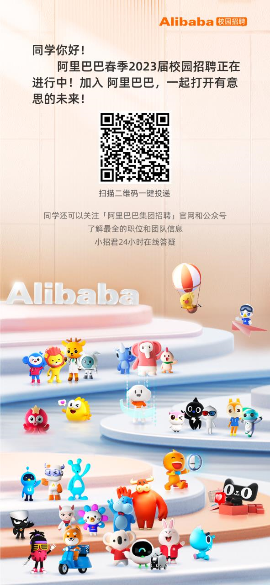

1. 阿里云流量工程团队2023届实习生开始招聘，团队氛围良好，培养体系完善， 欢迎大家积极投递 ，可联系南大师兄内推  微信号：shaoqian_zh

2. （帮转）蚂蚁金服认知计算组招收算法实习生 leader为国家杰青 陈景东教授 团队具体介绍：https://www.yuque.com/docs/share/c45ea361-8b6c-4577-8e77-42300cfb4131?#

3. 阿里和蚂蚁算法实习生招聘，详情可咨询这个老哥 -> （微信：15380929106）

   岗位职责
   负责机器学习相关算法研发，沉淀算法并支持用户运营、资金营销、推荐搜索广告等多个金融场景。支持在NIPS、ICLR、KDD、AAAI、SIGIR等会议期刊发表高水平论文。

   岗位要求
   0. 2022.11-2023.10 毕业的硕士，或者在读博士，专业不限
   1. 熟悉主流机器学习/深度学习相关算法
   2. 良好的学习和沟通能力，有技术好奇心，钻研精神
   3. 有点过程、序列建模、自然语言处理、点击率预测、多任务学习相关研究经验者优先考虑
   4. 有国际会议论文发表经验者优先考虑

   岗位吸引
   我们会即时反馈面试进度，无论合适与否当天告知结果，绝对不存在卡流程的情况，有任何要求都可以微信沟通
   团队氛围好，组员相处融洽，经常聚餐团建，反对PUA和996，绝对不卷
   我们提倡高效工作，反对低效内卷，8点免费打车下班
   实习转正概率极大，去年实习生百分百拿到转正offer
   实习薪资优越，去年400+每天，2000房补，餐补北上25，杭州20每顿

   转正后福利为：
   安家补贴：社会工龄三年内北上广深杭2000/月，其他城市1500
   iHome无息买房贷款: 北上广深80w，杭州60W
   特色假期：每年 7-15天年假，5天健康假，1-3天路途假，10天育儿假，1天outing假
   免费自己与家人体检
   百万医疗商业保险
   2000每年的outing费用

   欢迎加微信15380929106咨询

4. 阿里内推，我们系10级学长

